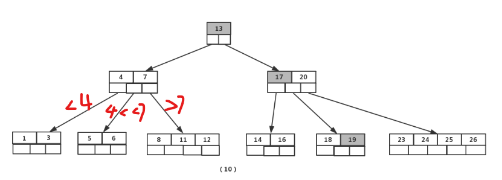

# B树&&B+树

------

B树基于平衡二叉树，一个m阶B树特点：

* 每个结点存储关键字（一般是数据的指针）和指向下一层结点的指针（叶子结点没有）。结点内部的关键字都是有序的。

* 根子结点数为 [2, m]，关键字数在此基础上-1，为[1, m - 1]；内部结点子结点数为[ceil(m / 2), m]，关键字数为            [ceil(m / 2) - 1, m - 1]；叶子结点关键字数和内部结点相同，但子结点数为0。
* 叶子结点都在同一层，高度一致。
* 由于是搜索树，所以左儿子关键字 < 根关键字 < 右儿子关键字，不存在相同的关键字。

B树插入时，先找到要插入关键字的结点，然后如果检查是否超过上限，如果超过要将中间关键字上移到父结点；不断向上调整，直到满足B树规则。

删除时，先找到要删除关键字的结点，然后检查是否低于下限，如果低于则检查相邻兄弟结点是否丰满（借出后有足够多的关键字），如果有，则去父结点借父关键字（即两个儿子分别是该结点和要选择的兄弟结点）给该结点，然后该兄弟结点要上移一个关键字填补借出的父关键字。如果兄弟结点是父关键字的左儿子，则选最右的一个关键字；右儿子则选最左。

如果没有丰满结点，则选择一个相邻兄弟结点合并，并且他们的父关键字也要下移被合并成一个结点。这样可能导致父结点低于下限，所以需要不断向上调整，直到满足B树规则。

B树的查询很高，和树高相关，大概为O(logmN)，这里m是底数，N表示总结点数。这里我们不再乘以O(log2m)，2是底数。主要是因为实际使用中都是整个结点的I/O，并不针对某个关键字数据，每个结点实际上是一页或者一个分区。插入和删除应该也是这个复杂度。

------

B+树和B树很类似，区别：

* 所有结点关键字都是索引，并不是实际的数据。非叶子结点的指针指向的是其他结点，而叶子结点的指针指向实际的数据。
* 左儿子关键字 < 根关键字 <= 右儿子关键字，存在相同的关键字。
* 叶子结点都在同一层，按照关键字的大小从小到大链接起来。
* 父关键字必须是右子树最左结点的最左关键字。

插入的时候中间关键字如果上移，如果它已经是分裂后右子树的最左关键字，则直接上移；否则需要将它加到分裂后右子树最左结点的最左边。这样是为了保证上面第4条性质。

删除的时候，如果兄弟丰满，直接向兄弟借。如果是左兄弟，则借它最右关键字；右兄弟，则最左。另外，在这个过程中，调整完后的这个结点它的最左关键字可能会发生变化，那么包含这个最左关键字的祖先关键字必须要同步更新。我个人觉得除了最底层的叶子结点外，其他结点中的关键字其实是叶子结点最左关键字的指针，这样只要更新这个指针，那么一旦叶子结点的最左关键字变动，那么与它关联的祖先节点的祖先关键字都会随之变动。

不丰满就合并，这里父关键字如果重复了（比如刚好是右儿子的左关键字），可以只删除不合并，避免重复。这里合并后原来的父关键字保持不变，不需要更新，因为合并后它的右子树变成了合并前右儿子的最左关键字的左子树，简单说就是这个最左关键字还是不变的，所以不需要更新对应的父关键字。

------

B+树相比B树有几个明显的优点：

* 有一种说法是B树的每个内部结点存储的是卫星数据（实际的记录）而不是指向数据的指针，这样同样大小的结点（页/分区），B+树容纳的元素数会更多，即m更大。那么如果N固定，则B+树高度越低，I/O的次数也会越少，所以效率更高。
* B+树查询更加稳定，不像B树找到了就停止。B+树必须从根结点一直找到叶子结点（即便中途遇到过存有所需索引的结点），这保证了不同数据的查询效率是一致的，不像B树最好和最坏情况差距很大。理由很简单，B+树中只有叶子结点才存有卫星数据或者指向卫星数据的指针。
* B树范围查询需要对整棵树进行中序遍历，因为这样才能得到有序的排列，然后进行比较；而B+树最低层直接维护了一个有序链表，所以直接遍历链表就可以得到所需要的结果了。很显然B+树的效率更高。

------

参考链接：

B+树这部分比较有争议，定义都有多个不同的版本，这里我选的是一个比较容易理解的，主要的特征还是统一的。

> https://www.cnblogs.com/lianzhilei/p/11250589.html (B树参考)
>
> https://blog.ouyangsihai.cn/mian-shi-guan-wen-ni-b-shu-he-b-shu-jiu-ba-zhe-pian-wen-zhang-diu-gei-ta.html#toc-heading-9 (B+树参考)
>
> https://blog.csdn.net/qq_26222859/article/details/80631121 （B+树优点）

最后介绍一个非常实用的数据结构可视化工具：

> https://www.cs.usfca.edu/~galles/visualization/Algorithms.html