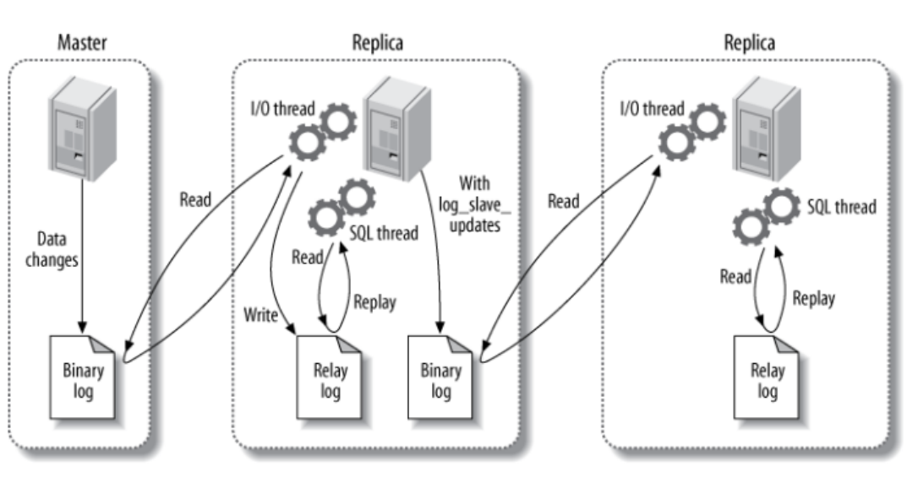

# 性能优化

### 索引优化

* 索引列不能是表达式的一部分，也不能是函数的参数。
* 使用多列索引（联合索引）而不是单列索引。
  * 即便给多个列分别设置单列索引，那么MySQL也只是会选择选择性最高的那一列。假设全表有10000条记录，单列索引将搜索范围缩小到了100条，那么实际上它还需要扫描这100行才能得到最后的结果；而如果设置多列索引，可以直接将搜索范围定位到1条，效率明显高很多。
* 用多列索引时，因为涉及到最左前缀原则，所以选择性强的索引列放前面。
* 对于字符串类型的列设置索引，要用前缀索引，否则索引空间开销太大。
* 覆盖索引，索引可以直接拿到所需字段，效率很高。

### 查询性能优化

* 优化数据访问
  * select只返回所需列，尽量不用select * 。
  * select只返回所需行，通过limit限制。
  * 缓存重复查询的数据。
  * 减少mysql server扫描的行数，也就是要使用索引。最佳的选择是多列索引和覆盖索引。
* 重构查询方式
  * 切分大查询，比如执行Delete操作，可以用函数 + limit实现。即用循环结构执行，每次循环限制删除固定的数目，避免一次性执行完整个大查询。
  * 分解大连接查询(join)。即将一个大连接查询分解成多个单表查询，然后交给应用层关联和整合这些查询结果。因为单表查询的缓存能够被不同的其他查询所使用，但是如果只是针对某个连接查询做的缓存，那么换一种查询方式，整个缓存就基本不可用了。

### 切分

切分方式主要有两种：水平切分和垂直切分。如果是水平切分，可以根据不同的ID范围进行切分，或者用hash(ID) % N的方式，将余数相同的ID分到一个表里；如果是垂直切分，会更多考虑列的关系密集程度，通过建立<列，表>之间的映射来将不同列划分到不同表。

切分会存在一些问题：

* 事务。因为现在一个事务可能会涉及到很多不同的结点，如果一个结点失败，则整个事务失败，需要回滚。需要分布式事务解决。
* 连接。就是上面的分解大连接查询。
* ID唯一。比如插入到不同的结点的时候怎么知道这个ID是否在其他结点也出现过呢，要保证不能使用重复的ID。
  * 用全局唯一ID。可能要通过一个中心结点（类似于master）来记录一个ID的表，其他结点插入时先查询这个ID是否在这个表里。
  * 每个结点指定一个范围，且不同范围独立没有交集。这个很好理解，没有交集就避免了重复。
  * 分布式ID生成器。通过算法自动生成ID，且能够保证ID唯一。

### 复制

主从同步的三个线程：

* binlog线程：将master的操作写入Binary log。
* I/O线程：slave从master的Binary log中读取日志并写入本地的Relay log。
* SQL线程：slave读取Relay log并重新执行一遍所有操作。

对于有多个slave的情况，可以不通过直接和master同步，而是和已经同步的slave进行同步。即相当于把该slave视为“master”，作“主从同步”。上面的3个线程也是一样的。（个人猜想是不是通过server_id来实现，如2(slave)和1(master)同步，3(slave)和2(slave)同步）

主从同步多用于读写分离，如master作写操作而slave们作读操作。读写分离可以提高性能：

* 读写分离，互不影响。如果只是单一的数据源，写的时候会加排他锁，如果是表级锁，那么想要读其他数据是不可能的；但分离的话，就可以。
* slave可以使用MyISAM引擎，因为它读的性能比较高，而且开销/成本小。而且只是读的话也不会涉及到事务。
* 增加冗余，多个slave也相当于对原始数据做了多次的备份，即使一个结点挂了，也不会影响到什么，更加可靠安全。

读写分离可以用代理服务器实现，应用层直接请求服务器以进行数据的操作，服务器根据负载均衡的原则转发到不同的数据结点。