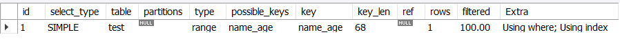

# 索引

大多数MySQL存储引擎的索引都是B+树索引。

### 前缀索引

就是如果索引列是字符串类型的，可以只考虑将字符串前面部分（前缀）作为索引，从而节约空间，同时提高效率。这里涉及到索引选择性的概念。即索引中不重复的值 / 所有的值，这个值的范围在(0, 1]之间；当索引列唯一时，选择性最高，为1。

建议优先采用选择性高的索引列作为索引。但即便如此，如果前缀重复，还需要匹配原字符串，从而筛选出想要的结果。

### 联合索引

我们可以选择建立多个独立的索引，但更多时候，会建立多个列一起的联合索引。联合索引只能进行最左前缀匹配，如一个联合索引(school, age)，查询语句条件为where age = 20，则无法命中该联合索引。也就是说使用联合索引时，必须从左到右，先命中前面的索引列，然后才能继续下一列。

另外，索引要求索引列能够有序化，因为它的结构基于B+树叶子层的有序链表。考虑范围查询语句：where school > “a” and age > 12，我们能保证school字段有序，但不能保证筛选后的结果age字段仍然有序。也就是这里只能命中school索引列，而无法命中整个联合索引。当查询语句为where school = "a" and age > 12时，才可以都保证两者有序，命中联合索引。

联合索引的最大用途是形成覆盖索引，提高查询效率。

这里用一个例子简单测试一下联合索引。

建表：

``` mysql
create table test(
	id int not null auto_increment,
    name varchar(20),
    age int,
    primary key(id),
    index name_age (name, age)
) engine = InnoDB default charset = utf8;
```

插入数据并显示：

``` mysql
SELECT * FROM test order by id;
```


查看索引：

``` mysql
show index from test;
```


查看索引使用情况：

``` mysql
explain SELECT * FROM test where age > 40;
```

``` mysql
explain SELECT * FROM test where name = "d" and age > 40;
```

``` mysql
explain SELECT * FROM test where name > "d" and age > 40;
```





虽然都有Using Index，但实际效果是不一样的。

语句1其实还是扫描整个表所有行，相当于没有命中任何索引；语句2命中了整个联合索引，直接拿到结果，也就是1行；语句3只命中了name索引列，共6行，后续还要进一步筛选。

### 聚簇索引VS非聚簇索引

MyISAM引擎用的是非聚簇索引；而InnoDB用的是聚簇索引。无论哪种引擎，都可以分为主键索引和二级索引（非主键索引）两类。只有InnoDB的主键索引可以称为是聚簇索引。

非聚簇索引结构比较简单，无论主键索引还是二级索引，叶子结点都是由索引列列值，行号（行号可以作为指针指向磁盘中的行数据）构成。


每次查找到叶子结点后，还需要通过叶子结点上的指针获取存放在磁盘上的实际行数据（称为回行），所以会消耗一部分时间。

------

而聚簇索引比较复杂一些，它一般是只针对主键建立索引。如果没有指定主键，则会找一个唯一且非空的列作索引，如果还是没有，InnoDB会定义一个隐藏的主键，对其建立索引。

一个表只能有一个聚簇索引，因为一旦指定索引列，数据就会按该列进行有序存储，所以是固定的。聚簇索引叶子结点存储的是主键列列值，事务ID（版本号），回滚指针以及其他非主键列列值。换句话说，它将每一行数据都存储到了叶子结点上。所以，我们可以认为InnoDB的每一张表就是一个聚簇索引，不需要额外建立。


对于InnoDB二级索引，实际和MyISAM的比较类似。只不过将行号换成了主键值。


对于聚簇索引来说，可以直接获取行数据；而对于二级索引，需要先获得主键值，再用聚簇索引（主键索引）获得对应的行数据。

另外，对于聚簇索引来说，最好选择自增的主键作为索引。这样能始终保持插入时是顺序的，如果磁盘页满了，直接插入到新的页即可；可是如果乱序插入，则需要页分裂操作，即大量叶子结点从一个页迁移到另一个页，并且由于这些结点都比较大（附带行数据），所以分裂的时间、空间开销也很大。

------


### 覆盖索引

覆盖索引指索引列已经包含了需要查询的所有字段，则此时直接得到结果而无需多进行一次获取行数据的操作（对于MyISAM，就是不用回行；对于InnoDB，则不用再进行一次主键索引）。所以说，覆盖索引的效率是比较高的，同时也避免了大量的磁盘数据读取。

前面说了，如果我们真的想用覆盖索引，可以将查询字段设为复合索引。此外，前缀索引无法和覆盖索引一起使用。

------

参考链接：

> https://www.cnblogs.com/smallleiit/p/10890071.html
>
> https://blog.csdn.net/UFO___/article/details/81162087
>
> https://www.cnblogs.com/qlqwjy/p/8592684.html
>
> https://www.cnblogs.com/crazylqy/p/7615457.html
>
> https://blog.csdn.net/wanghao112956/article/details/91040590
>
> https://www.cnblogs.com/Aiapple/p/5693239.html
>
> https://www.runoob.com/mysql/mysql-index.html (MySQL的索引语法)